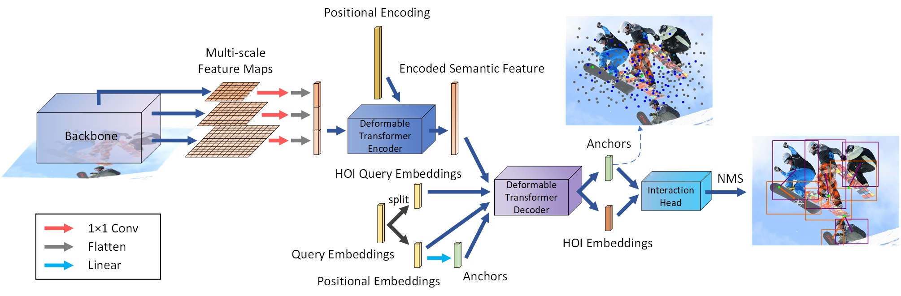

# QAHOI

QAHOI: Query-Based Anchors for Human-Object Interaction Detection ([paper](https://arxiv.org/abs/2112.08647))



## Requirements

- PyTorch >= 1.5.1
- torchvision >= 0.6.1

```bash
pip install -r requirements.txt
```

- Compiling CUDA operators

```bash
cd ./models/ops
sh ./make.sh
# test
python test.py
```

## Dataset Preparation

Please follow the HICO-DET dataset preparation of [GGNet](https://github.com/SherlockHolmes221/GGNet).

After preparation, the `data` folder as follows:

```bash
data
├── hico_20160224_det
|   ├── images
|   |   ├── test2015
|   |   └── train2015
|   └── annotations
|       ├── anno_list.json
|       ├── corre_hico.npy
|       ├── file_name_to_obj_cat.json
|       ├── hoi_id_to_num.json
|       ├── hoi_list_new.json
|       ├── test_hico.json
|       └── trainval_hico.json
```

## Evaluation

Download the model to `params` folder.
- We test the model with NVIDIA A6000 GPU, Pytorch 1.9.0, Python 3.8 and CUDA 11.2.

| Model | Full (def) | Rare (def) | None-Rare (def) | Full (ko) | Rare (ko) | None-Rare (ko) | Download |
|:---:|:---:|:---:|:---:|:---:|:---:|:---:|:---:|
| Swin-Tiny | 28.47 | 22.44 | 30.27 | 30.99 | 24.83 | 32.84 | [model](https://drive.google.com/file/d/1CLcR_upML6gakF8u11Vxdv_K6xZ0k3Dm/view?usp=sharing) |
| Swin-Base*+ | 33.58 | 25.86 | 35.88 | 35.34 | 27.24 | 37.76 | [model](https://drive.google.com/file/d/1jfw304N3KYvj25-94-T2a-SfLNkmcdj0/view?usp=sharing) |
| Swin-Large*+ | 35.78 | 29.80 | 37.56 | 37.59 | 31.36 | 39.36 | [model](https://drive.google.com/file/d/1ve97e1foCxvsmllOWcFRx8kkYEDO882m/view?usp=sharing) |

Evaluating the model by running the following command.

`--eval_extra` to evaluate the spatio contribution.

`mAP_default.json` and `mAP_ko.json` will save in current folder.

- Swin-Tiny

```bash
python main.py --resume params/QAHOI_swin_tiny_mul3.pth --backbone swin_tiny --num_feature_levels 3 --use_nms --eval
```

- Swin-Base*+

```bash
python main.py --resume params/QAHOI_swin_base_384_22k_mul3.pth --backbone swin_base_384 --num_feature_levels 3 --use_nms --eval
```

- Swin-Large*+

```bash
python main.py --resume params/QAHOI_swin_large_384_22k_mul3.pth --backbone swin_large_384 --num_feature_levels 3 --use_nms --eval
```

## Training

Download the pre-trained swin-tiny model from [Swin-Transformer](https://github.com/microsoft/Swin-Transformer) to `params` folder.

Training QAHOI with Swin-Tiny from scratch.

```bash
python -m torch.distributed.launch \
        --nproc_per_node=8 \
        --use_env main.py \
        --backbone swin_tiny \
        --pretrained params/swin_tiny_patch4_window7_224.pth \
        --output_dir logs/swin_tiny_mul3 \
        --epochs 150 \
        --lr_drop 120 \
        --num_feature_levels 3 \
        --num_queries 300 \
        --use_nms
```

Training QAHOI with Swin-Base*+ from scratch.

```bash
python -m torch.distributed.launch \
        --nproc_per_node=8 \
        --use_env main.py \
        --backbone swin_base_384 \
        --pretrained params/swin_base_patch4_window7_224_22k.pth \
        --output_dir logs/swin_base_384_22k_mul3 \
        --epochs 150 \
        --lr_drop 120 \
        --num_feature_levels 3 \
        --num_queries 300 \
        --use_nms
```
Training QAHOI with Swin-Large*+ from scratch.

```bash
python -m torch.distributed.launch \
        --nproc_per_node=8 \
        --use_env main.py \
        --backbone swin_large_384 \
        --pretrained params/swin_large_patch4_window12_384_22k.pth \
        --output_dir logs/swin_large_384_22k_mul3 \
        --epochs 150 \
        --lr_drop 120 \
        --num_feature_levels 3 \
        --num_queries 300 \
        --use_nms
```

## Citation

~~~
@article{cjw,
  title={QAHOI: Query-Based Anchors for Human-Object Interaction Detection},
  author={Junwen Chen and Keiji Yanai},
  journal={arXiv preprint arXiv:2112.08647},
  year={2021}
}
~~~